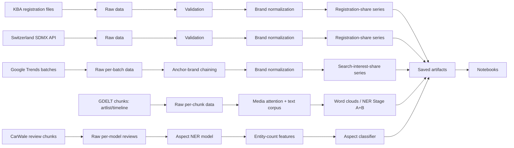

# Analysis of German vs. Chinese Car Brand Market Share, Search Interest, Media Coverage & Customer Reviews (KBA, Switzerland, Google Trends, GDELT & CarWale)

German title: Analyse des Marktanteils, Sucheinteresses, der Medienberichterstattung und der
Kundenbewertungen deutscher und chinesischer Automarken (KBA, Schweiz, Google Trends, GDELT,
CarWale).

This project measures German vs. Chinese car brands using five real, independent data
sources: new-vehicle registration counts published by the Kraftfahrt-Bundesamt (KBA,
national/Germany), new-vehicle registration counts published by the Swiss Federal Statistical
Office (national/Switzerland), the public relative search-interest index published by Google
Trends (trends.google.com), English-language news coverage from the GDELT Project's public
DOC 2.0 API (gdeltproject.org), and real customer vehicle reviews scraped from CarWale
(carwale.com). There is no synthetic or sample data anywhere in the pipeline, no dashboard, and
no test suite: every entry point requires real, downloaded/scraped (or manually obtained) data
and raises a clear error rather than substituting fake data when it isn't available.

**KBA and Switzerland measure the same kind of thing (a national new-registration flow) and so
are meaningfully comparable to each other in kind** -- though Switzerland is a much smaller
market than Germany, so compare percentages, not absolute counts. **Google Trends, GDELT, and
CarWale reviews each measure a genuinely different kind of thing -- public search interest,
public media coverage, and real customer opinion, respectively, not market outcomes** -- none
of the three must ever be read as a market-share/registration figure. **Google Trends is,
unlike KBA/Switzerland, deliberately limited to just two brands (Volkswagen and BYD)** as a
directional indicator (see "Google Trends" below for why); **GDELT instead covers the top 5
German and top 5 Chinese brands** (ranked from real KBA registrations, see "GDELT News
Analysis" below), since GDELT has no per-request keyword cap the way Trends does; **CarWale
reviews train on Volkswagen + BYD and then apply the trained model to a broader set (adding
MG, BMW, Mercedes-Benz)** -- see "CarWale Customer Review Aspect Analysis" below.

## Project motivation

The central question is how German and Chinese car brands have evolved over the last several
years, as a real market outcome (national new-registration flow, KBA/Switzerland), as public
search interest (Google Trends), as public English-language media coverage (GDELT), and as real
customer opinion (CarWale reviews) -- and whether these perspectives move together or diverge.

## Research questions

1. How has the new-registration market share of German vs. Chinese car brands changed over
   time, in Germany and in Switzerland?
2. Which individual brands hold the largest share within each group, for each source?
3. How does the market share of a brand change from one reporting period to the next?
4. How large is the combined share of brands that are neither German nor Chinese
   ("Other/Miscellaneous"), and how does it change over time?
5. Does the national new-registration trend observed in Germany (KBA) also hold in
   Switzerland's national registrations, a much smaller neighboring market?
6. How has public search interest in Volkswagen vs. BYD -- each group's flagship brand, used
   as a directional indicator -- changed over the last 5 years (Google Trends, Worldwide by
   default, configurable), and does that trend track the real registration trend above or run
   ahead of/behind it?
7. How has English-language media attention to the top-5 German vs. top-5 Chinese brands
   changed over time (GDELT, 2021-2025), and what vocabulary/entities (technology, regulation,
   suppliers, factories, ...) characterize that coverage?
8. What do real customers actually talk about in their vehicle reviews (engine, comfort,
   service, safety, price, ...), and does the average rating for a given aspect differ between
   German and Chinese brands?

## Data sources

| Source | Measures | Scope | Interpretation |
|---|---|---|---|
| [Kraftfahrt-Bundesamt (KBA)](https://www.kba.de/) | New passenger-car registrations per year | National (Germany) | Real market flow; not a measure of interest, sentiment, or intent |
| [Swiss Federal Statistical Office](https://www.stats.swiss/) | New passenger-car registrations per year | National (Switzerland) | Real market flow; methodologically comparable to KBA |
| [Google Trends](https://trends.google.com/) | Relative public search-interest index, weekly/monthly (aggregated to annual) | Worldwide (configurable geo); limited to Volkswagen & BYD | Search interest only -- not a market outcome; not comparable in kind to KBA/Switzerland; directional indicator, not a comprehensive brand comparison |
| [GDELT Project](https://www.gdeltproject.org/) (DOC 2.0 API) | English-language news article metadata/volume/tone, 2021-2025 | Global, English sources only; top-5 German + top-5 Chinese brands | Media coverage only -- not a market outcome or a measure of consumer intent |
| [CarWale](https://www.carwale.com/) (web scrape) | Real customer vehicle reviews (title, comment, star rating) | India-based reviews, English; trained on Volkswagen + BYD, applied to a wider brand set | Real customer opinion/aspect focus -- not a market outcome, search interest, or media coverage |

`src/car_interest_nlp/data/kba.py`, `src/car_interest_nlp/data/switzerland.py`,
`src/car_interest_nlp/data/google_trends.py`, `src/car_interest_nlp/data/gdelt.py`, and
`src/car_interest_nlp/reviews/scraping.py` are the five adapters. KBA's registration-overview
pages link to further subpages rather than to files
directly, so a specific `listing_url` must be located manually on kba.de before `mode="live"`
can discover/download files; Switzerland is queried directly from a public SDMX 2.1 REST API
(`disseminate.stats.swiss`) -- one call for the national new-registration figures (already
filtered server-side to national totals, new registrations only, all fuel types, annual) and one
for the brand-code lookup table, since the API returns numeric make codes rather than names;
Google Trends has no official API and is queried through the unofficial `pytrends` client, one
batch of up to 5 keywords at a time (see "Google Trends" below for why that matters); GDELT's
DOC 2.0 API is public and documented, but aggressively rate-limited and metadata/title-only (see
"GDELT News Analysis" below). Real KBA table layouts vary by report type and are not auto-mapped
to a universal schema (to avoid guessing a column layout) -- a downloaded file must already be
tidied into the `reporting_period`/`brand`/`value_type`/`registrations` shape `validate_kba_data`
expects; the Switzerland adapter tidies its own well-known raw layout itself.

Every KBA/Switzerland dataset genuinely contains many brands that are neither German nor
Chinese (Toyota, Ford, Hyundai, ...), and they must be counted, not dropped -- otherwise
German/Chinese percentages would be computed against only the tracked brands' total instead of
the true total of all registered cars, making both shares look far larger than they really are.
Raw brand strings that don't match a specific German/Chinese alias in `configs/brands.yaml` are
therefore bucketed into `Other/Miscellaneous` ("Sonstige") by default -- a deliberate,
deterministic rule ("not German/Chinese => Other"), not a guess about which specific brand it
is. Every KBA/Switzerland market-share percentage in this project is computed against the true
total across German + Chinese + Other, never against just the tracked subset. Google Trends has
no equivalent "Other" bucket -- see below.

## Google Trends

**This analysis is deliberately limited to two brands -- Volkswagen (German) and BYD
(Chinese) -- as a directional search-interest indicator, not a comprehensive brand-by-brand
comparison like the KBA/Switzerland chapters.** `configs/sources.yaml`'s
`google_trends.tracked_brands` controls this list (default `["Volkswagen", "BYD"]`); it is a
strict subset of `configs/brands.yaml`'s full German/Chinese brand list, not the whole thing.
This scope was chosen specifically because of two technical limitations of the real,
unofficial Google Trends endpoint, confirmed while building this adapter:

1. **Google publishes no official Trends API.** This project uses the unofficial `pytrends`
   client, which is known to rate-limit/block requests aggressively and unpredictably,
   independent of this project's own request pacing (`rate_limit_seconds` in
   `configs/sources.yaml`, plus its own exponential-backoff retry in
   `google_trends._fetch_interest_over_time`). It also allows **at most 5 keywords per
   request** and **normalizes each request's values to 0-100 independently** -- covering the
   full ~30-brand list in `configs/brands.yaml` would require many separate keyword batches
   (at 9 German + 22 Chinese brands, 8 batches of 5), each one a further chance to be
   rate-limited/blocked, making a full sweep unreliable as a data source in practice.
2. **Several tracked brand names are ambiguous as bare search terms** -- e.g. "Mini", "Smart",
   "MAN", "MG", and "Ora" are also common words/acronyms unrelated to cars -- which would add
   noise to smaller/lesser-known brands' search-interest signal without a more involved
   disambiguation step (e.g. resolving each brand to a Google Knowledge Graph topic ID via
   `pytrends.suggestions()`), which this project does not attempt.

Volkswagen and BYD were chosen as each group's clearest, least ambiguous flagship brand. The
adapter's underlying machinery still supports more than 5 tracked brands, though, in case
`tracked_brands` is ever extended: with more than 5 keywords, requests are split into batches
of <=5 (`build_keyword_batches`), each carrying the same anchor brand (`google_trends.anchor_brand`,
default `Volkswagen`) so the independently-normalized batches can be rescaled onto one common,
comparable index (`chain_trends_batches()`) before the weekly series are aggregated into an
annual `search_interest_index` per brand (`annualize_trends_series()`). With only two tracked
brands by default, both fit in a single request and this chaining step is a no-op in practice.

Because every Trends keyword is chosen directly from `configs/brands.yaml` (not parsed from a
raw report), there is no "Other/Miscellaneous" bucket for this source -- only the explicitly
tracked brands are queried, so `google_trends_interest_share` is each brand's share of the
*tracked brands'* (by default: just Volkswagen + BYD) total chained interest, not a share of all
Google searches (no such total is measurable) and not a share of all car-brand searches either.
This is a materially different denominator than `kba_registration_share`/`ch_registration_share`
and the two must not be compared as if they were the same kind of percentage.

Given how aggressively the unofficial endpoint can rate-limit/block requests, `data/raw/trends/`
still caches each keyword batch independently as soon as it succeeds, so a run that fails
partway through (relevant again if `tracked_brands` is ever extended past 5 brands) resumes
from where it left off rather than starting over.

**In practice, this project's own automated fetch attempts were repeatedly blocked** (HTTP 429
/ `USER_TYPE_EMBED_OVER_QUOTA`) even after exponential backoff up to 120 seconds between
retries -- this is a real, reproducible characteristic of Google's anonymous Trends quota, not
a bug in this project's request pacing. `ensure_trends_dataset()`/`build_trends_analysis_dataset()`
therefore also support a manually exported CSV (downloaded by hand from
[trends.google.com](https://trends.google.com/)'s own UI "Download CSV" button) as a first-class
input, checked *before* attempting any automated fetch: at `raw_directory /
google_trends.TRENDS_MANUAL_EXPORT_FILENAME` (`data/raw/trends/google_trends_manual_export.csv`
by default) or an explicit `manual_file_path=...`. This repository's checked-in dataset was
built exactly this way -- see "Obtaining Google Trends data" below.

A real manual export's column headers are whatever label Google's own UI assigned the search
term (e.g. **"BYD Auto"**, not "BYD" -- Google's own topic-disambiguation label for the automaker),
which can differ from this project's canonical brand names; `tidy_manual_trends_export()` melts
every non-date column as-is and lets the existing alias-resolution machinery
(`normalize_trends_brands()`, `configs/brands.yaml`) map it to the canonical brand, exactly like
KBA/Switzerland already resolve source-specific raw brand spellings. `configs/brands.yaml`'s BYD
entry includes `"BYD Auto"` as an alias for this reason.

**This repository's current Google Trends data is Worldwide search interest, not
Germany-specific** -- `configs/sources.yaml`'s `google_trends.geo` is `""` (pytrends' convention
for worldwide) to match the real manually exported dataset actually being used, not `"DE"`.
Set it to `"DE"` (and re-fetch, live or manually) for Germany-only interest matching the
KBA/Switzerland chapters' geographic scope instead.

**This chapter compares 2021-2025, matching KBA/Switzerland, not the full "last 5 years" window
a fetch/export actually returns.** `timeframe: "today 5-y"` is relative to the request/export
moment, so it always includes whatever partial current year has elapsed so far (e.g. an export
made in mid-2026 includes a partial Jan-Jul 2026); `annualize_trends_series()` drops any year
after `configs/sources.yaml`'s `google_trends.end_year` (default `TRENDS_DEFAULT_END_YEAR`,
2025) so that trailing partial year is never averaged in as if it were a complete calendar year.

**Chart labels name the actual brands (Volkswagen/BYD), not generic group names.** The shared
plotting functions (`plot_kba_registration_trend`, `plot_kba_share_pie_charts`) default to
labeling by `brand_group` ("Deutsche Marken"/"Deutsch", "Chinesische Marken"/"Chinesisch"),
which is correct for KBA/Switzerland (real many-brand aggregates) but would misleadingly imply
an aggregate here, where each "group" is really one named brand. `scripts/generate_trends_figures.py`
and the notebook chapter pass a `group_labels={"german": "Volkswagen", "chinese": "BYD"}`
override (derived from the data itself, not hardcoded) plus `legend_title="Marke"` to both
functions for this reason.

## GDELT News Analysis

A fourth, structurally different chapter (`notebooks/news_media_nlp_analysis.ipynb`, a separate
notebook from the market-share/search-interest one, since this is a comparably large analytical
axis on its own): English-language news coverage of the top-5 German and top-5 Chinese brands
(ranked from real cumulative KBA registrations 2021-2025, see
`analysis/top_brands.get_top_brands()` -- confirmed: Volkswagen, Mercedes-Benz, BMW, Audi, Opel;
MG, BYD, Polestar, Great Wall, Lynk & Co), pulled from the GDELT Project's public DOC 2.0 API.

**Query building.** `data/gdelt.build_query(brand)` composes a query per brand as just the
quoted exact phrase `"<brand> car"` (e.g. `"MG car"`) plus `sourcelang:eng`, and optional
`sourcecountry:`/`domain:`/`nearN:"..."` filters -- e.g. `"MG car" sourcelang:eng`.
**Confirmed directly against the real API, two separate short-keyword rejections**: a quoted
phrase search of just `"BMW"` (3 characters) returns HTTP 200 with the plain-text body "The
specified phrase is too short"; a *bare, unquoted* short brand token (e.g. `MG`, 2 characters)
separately triggers "Your search contained a keyword that was too short". A length-conditional
quoting scheme (quote only if long enough) does not reliably avoid either error for every real
brand name in this project's lists -- concatenating `"car"` onto the brand and always quoting
the combined phrase keeps the brand name from ever being sent as its own short standalone token,
quoted or not.

An earlier version of this query also ANDed a `"german"`/`"chinese"` context word onto the
phrase (e.g. `"MG car" chinese sourcelang:eng`) to further narrow relevance, but this was
**tried and then removed after a direct live comparison**: for `"Volkswagen car"`, adding
`german` cut real matches to just ~13% of days in the 2021-2025 range at roughly 1/100th the
coverage-share values; without it, the same phrase alone matched **54% of days**, with values
up to two orders of magnitude larger (max `0.0667` vs. a handful of `0.0004`-sized spikes) --
real articles about a brand rarely contain the literal word "german"/"chinese" even when
reporting on that brand's home market, so the context word was cutting real coverage far more
than it was improving relevance.

**Real, persistent rate limiting.** GDELT documents "please limit requests to one every 5
seconds"; this project's development environment saw repeated HTTP 429s even at 10-15+ second
spacing (the same symptom seen with Google Trends earlier). `data/gdelt._fetch_gdelt()` retries
the *same* request rather than moving on -- it honors a real `Retry-After` response header when
GDELT sends one, and otherwise falls back to a jittered exponential backoff following this exact
schedule (attempt N's range is the wait before attempt N+1): 60-120s, 120-240s, then a flat
150-300s for every further attempt -- `_BACKOFF_MAX_WAIT_SECONDS = 300.0` is a hard ceiling (no
single wait ever exceeds 5 minutes, regardless of `_BACKOFF_BASE_SECONDS`), not a fixed attempt
index to freeze growth at, so both the low and high end of each attempt's jitter range are
clamped against it directly (`GDELT_DEFAULT_MAX_ATTEMPTS = 15` spends up to 14 of these waits,
worst case ~66 minutes total, before giving up on one chunk). Requests are always issued
sequentially, never in parallel.
**Two fully separate fetch phases, each with its own function and its own notebook section.**
`data/gdelt_dataset_builder.ensure_gdelt_timelinevol_dataset()` and
`ensure_gdelt_artlist_dataset()` are independent, resumable, and cache each chunk as soon as it
succeeds -- so a run that only completes a handful of chunks before failing simply resumes next
time. The notebook calls `timelinevol` first (fast, ~10 requests) and shows its results/graphs
immediately, *before* starting the much slower `artlist` phase (~600 requests) -- rather than
one combined fetch step for both. `ensure_gdelt_dataset()` still exists as a thin wrapper
calling both in sequence, for simpler callers like `scripts/download_gdelt_news.py`. Given how
much real wall-clock time the retry strategy above can spend waiting out 429s, the default time
budget per phase is 480 minutes (`GDELT_DEFAULT_TIME_LIMIT_MINUTES` in the notebook) -- real
full coverage is still a multi-hour, multi-run operation by design, not a bug.

**`timelinevol`: one request per brand for the whole range, with a yearly-chunk fallback.**
`timelinevol` returns one real daily datapoint regardless of window width (**confirmed
directly, both for a one-year window and for the full 2021-2025 range**: a full calendar-year
request returned 365 real points and a full 5-year request returned 1808 of an expected 1826,
no width-specific truncation -- the 18 missing days are a real GDELT-side data gap, confirmed
to be the *identical* gap in both a single 5-year request and separately-fetched yearly
chunks). The primary strategy is therefore one request per brand spanning the whole configured
range (10 brands = 10 requests); if that single request fails for a brand after all retries,
`ensure_gdelt_timelinevol_dataset()` automatically falls back to five separate one-year
requests for that brand only (`year_windows`) rather than giving up on it entirely. Reading
(`analysis/media_attention.py`) mirrors whichever strategy actually succeeded per brand
(`gdelt_dataset_builder.timelinevol_paths_for_brand()`), so coverage is correct either way.
`artlist` is capped at `maxrecords=250` per request -- real cached monthly chunks for
Volkswagen/Mercedes-Benz already return exactly 250/250 articles every month, so it stays
chunked monthly (10 brands x 60 months = 600 requests by default); widening its window would
silently drop real articles. Its chunks are ordered window-major then brand-minor (every brand
for the earliest window, then every brand for the next, ...) rather than brand-major --
**confirmed directly**: brand-major ordering left 8 of 10 brands (all Chinese brands but one)
with zero real coverage after 6 hours of real fetching, since GDELT's rate limiting meant the
loop never got past the first two brands. Both `ensure_gdelt_timelinevol_dataset()` and
`ensure_gdelt_artlist_dataset()` take an optional `brands` override (`brand_queries(...,
brands=...)`) that replaces the default top-N-per-group selection with an explicit brand list,
using the exact same `build_query()` criteria either way -- the notebook uses this
(`GDELT_ARTLIST_BRANDS = ["Volkswagen", "BYD"]`) to restrict the slow `artlist` fetch to just
these two brands (2 x 60 = 120 requests instead of 600), since a full 10-brand `artlist` run
took too long and the geographic dominance map (below) only needs these two anyway; already-
cached chunks for other brands from earlier full-10-brand runs are untouched, just not further
completed. `top_n_brands`/`brands=None` (the default) still fetches the full top-5+5 selection,
e.g. via `scripts/download_gdelt_news.py`.

**Live/cached fetch mode.** Both `ensure_gdelt_timelinevol_dataset()` and
`ensure_gdelt_artlist_dataset()` take `fetch_mode="live"` (default, fetches whatever is still
missing) or `fetch_mode="cached"` (never sends a single request -- only checks what's already
on disk and reports coverage). The notebook exposes this as one `GDELT_FETCH_MODE` variable
controlling both phases, meant to be switched to `"cached"` once real data collection is done
so re-running the notebook (e.g. to redo the graphs) never spends any more of GDELT's
rate-limit tolerance.

**`mode=artlist` returns article metadata and titles only -- no article body text.** Real
per-article text needed for meaningful word clouds/TF-IDF/NER comes from a separate, explicitly
opt-in full-text scraping module, `data/article_text.py`: robots.txt is checked and never
bypassed (`urllib.robotparser`, cached per domain), a real per-domain minimum delay is enforced
across all queued URLs regardless of GDELT's own rate limit, and article bodies are extracted
with `trafilatura`. Fetch failures (paywalls, bot-blocking, JS-only rendering) are logged and
skipped, not treated as errors -- this is expected, common behavior across hundreds of arbitrary
news domains, not a project bug. **This is best-effort robots.txt compliance only**: scraping
may still exceed an individual publisher's Terms of Service beyond what robots.txt covers;
content fetched here is used solely for local, non-redistributed text statistics (word
frequency/NER), never reproduced or republished. It is off unless explicitly turned on for a
given run (`ENABLE_ARTICLE_SCRAPING` in the notebook / `scripts/fetch_article_texts.py`).
Articles that were never scraped fall back to their real GDELT title as text, rather than being
dropped (`nlp/corpus.py`).

**Media-attention-over-time** (`analysis/media_attention.py`) is built entirely from GDELT's own
aggregate `timelinevol` mode, not from tallying individual articles -- it stays cheap (~10
requests, one per brand, see above) and works regardless of article/scraping coverage. A
by-world-region breakdown (GDELT's `timelinesourcecountry` mode) was implemented earlier and
then removed to cut required request volume. `timelinevol` returns real daily datapoints (a
percentage: share of all GDELT-monitored global coverage that day), and GDELT has no documented
parameter to request pre-aggregated yearly buckets directly -- `summarize_attention_by_year()`
does that aggregation client-side, offline, over data already fetched (no additional requests),
taking the *mean* of each year's daily shares rather than the sum, since summing percentages has
no clean "yearly share" interpretation and can trivially exceed 100%. It also drops any row
outside `[2021, 2025]`: a yearly window's end date is inclusive, so its final real daily
datapoint is dated exactly the following January 1st -- confirmed directly in real cached
data -- which would otherwise show up as a misleading stray one-day extra year.
`plot_gdelt_attention_trend()` then sums each group's brands into a single German line and a
single Chinese line on one shared axes -- a direct group-vs-group comparison, not individual
brand curves (contrast `plot_gdelt_article_count_trend()`, which keeps per-brand lines since
the article-count chapter is about individual brand coverage, not an aggregate comparison).
`plot_gdelt_brand_attention_trend()` adds a direct two-brand comparison (Volkswagen vs. BYD by
default, no group aggregation), mirroring the Google-Trends VW-vs-BYD chapter in the other
notebook -- its caption combines the standard GDELT source note with
`GDELT_TIMELINEVOL_FETCHING_NOTE` (`visualization/style.py`), a second caption line that
documents the real fetching methodology (one full-range request per brand, exact quoted phrase
`"<brand> car"`, no context word, yearly-request fallback on failure) directly on the chart
itself, not just in this README. Both `_plot_overlaid_series()`-based charts share the same
shared-axes/percent-axis/missing-data-placeholder rendering logic.

**Geographic media dominance** (`analysis/media_geography.py` + `visualization/maps.py`)
compares exactly two named brands (Volkswagen vs. BYD by default) per real source country, from
the same cached `artlist` chunks -- no additional GDELT request. `build_country_dominance()`
uses GDELT's real per-article `sourcecountry` field (a full English country name, e.g.
"Germany", "Pakistan" -- confirmed directly against real cached data; empty-string values,
which GDELT returns when it cannot determine a source's country, are filtered out rather than
plotted as a phantom country) and counts real articles per (year, country, brand), producing a
`dominance_score` in `[-1, 1]` = `(count_a - count_b) / (count_a + count_b)` -- countries with
fewer than `min_total_count` (default 2) combined real articles are dropped rather than shown as
a noisy +-1 from a single article. `plot_media_dominance_choropleth()` renders one world map per
year on a diverging color scale anchored at the two brands' own `BRAND_GROUP_COLORS`, with a
neutral grey midpoint at an even split; countries with no real coverage for that year are simply
left uncolored, and a fully-empty year renders an honest "no data yet" placeholder instead of an
empty map. This is the one chart in the project built with `plotly` + `kaleido` (static PNG
export) rather than `matplotlib`: a real geographic choropleth needs actual country-boundary
geometry that matplotlib doesn't ship, and plotly resolves real country names directly
(`locationmode="country names"`) without a separate `geopandas`/GDAL dependency or a manual
name-to-ISO3 mapping table -- confirmed directly that `kaleido` can export a static PNG in this
project's environment. The notebook renders 2021 and 2025 side by side to show the real shift
in country-level coverage dominance over the study period.

**Word clouds** (`nlp/wordclouds.py`) cover the required 7 categories: German-brand and
Chinese-brand (frequency + TF-IDF, 4 total), one per real reporting year present in the corpus,
one technology-related, and one regulation/tariff-related (the latter two select documents that
mention a real gazetteer term, then cloud the *surrounding* vocabulary, not the gazetteer terms
themselves). Every cloud excludes brand names/aliases (`configs/brands.yaml`), generic news
boilerplate, and generic terms like "car"/"vehicle" via the shared `nlp/text_cleaning.py`
filtering, reused by both frequency and TF-IDF (`scikit-learn`) clouds so exclusions are
consistent.

**Custom automotive NER, two stages** (`nlp/ner/`):

- **Stage A** (`pipeline.py`, works immediately, no training needed): a real pretrained spaCy
  pipeline (`en_core_web_sm`) plus a rule-based `EntityRuler` (`gazetteer.py`) seeded from
  `configs/brands.yaml` (`CAR_BRAND`) and `configs/ner_gazetteer.yaml` (`CAR_MODEL`, `SUPPLIER`,
  `TECHNOLOGY`, `COMPONENT`, `FACTORY`, `REGULATION` -- real, curated industry terms). The
  `EntityRuler` runs `before="ner"` (spaCy's standard combination pattern), so exact gazetteer
  matches win over the pretrained model's generic guesses for the same span, while
  `PERSON`/`ORG`/`GPE` (used as `LOCATION`) still come from the pretrained model. **Verified
  directly** against realistic sentences: all 7 custom labels extracted correctly (e.g. `BYD` ->
  `CAR_BRAND`, `BYD Seal` -> `CAR_MODEL`, `CATL` -> `SUPPLIER`, `LFP battery` -> `TECHNOLOGY`,
  `battery pack` -> `COMPONENT`, `Debrecen plant` -> `FACTORY`, `EU tariff` -> `REGULATION`).
- **Stage B** (`seed.py`/`correction.py`/`train.py`/`evaluate.py`, trainable): Stage A run over
  the real corpus produces weak-supervision seed annotations (`generate_seed_annotations`),
  exported as JSONL for manual review (`export_seed_for_correction`) -- a human corrects
  spans/labels directly in the file and marks `"verified": true` per row.
  `correction.load_corrected_annotations()` validates every record (span bounds, known labels)
  and raises rather than silently skipping a malformed row. `train.train_ner_model()` fine-tunes
  `en_core_web_sm`'s real pretrained weights (per "do not train from scratch when a suitable
  pretrained pipeline is available" -- every other pipe is disabled during training, standard
  spaCy fine-tuning practice) and `evaluate.evaluate_ner_model()` scores the held-out dev split
  with spaCy's own `Scorer` (precision/recall/F1, overall and per label). **Verified end-to-end**
  via the real CLI chain (`train_ner_model.py` -> save to disk -> `evaluate_ner_model.py` reloads
  the model in a separate process -> real scores) -- with only a handful of seed sentences this
  produces low scores, as expected for that little data; real quality requires a real corpus and
  real manual correction, which this project does not fabricate.

**Progress bars, not repeated log lines.** Every long loop (GDELT fetching, article scraping,
NER training epochs) shows one live `tqdm` progress bar (`progress.iter_with_progress`) rather
than a log line per item. **Configurable time limits, set in the notebook.** Every long-running
phase accepts a `progress.TimeBudget`; the notebook defines `GDELT_FETCH_TIME_LIMIT_MINUTES`
(default 360 minutes -- see the retry-strategy paragraph above for why this one is larger)
/`ARTICLE_SCRAPING_TIME_LIMIT_MINUTES`/`NER_TRAINING_TIME_LIMIT_MINUTES` (default 15 minutes
each) as plain variables and passes them in -- when a budget expires mid-loop, the function
stops gracefully (not an error) and logs one summary line, since every phase's per-item caching
means nothing already done is lost.

## Execution modes

`build_analysis_dataset()` (KBA), `build_ch_analysis_dataset()` (Switzerland), and
`build_trends_analysis_dataset()` (Google Trends) -- used by the notebook and the `scripts/*.py`
entry points -- take a `mode` argument (default `"cached"`) and never fall back to synthetic
data:

```bash
uv run python scripts/collect_data.py --mode cached          # previously downloaded real files, no network calls
uv run python scripts/collect_data.py --mode manual_import    # validates a user-supplied file before use
```

`mode="live"` isn't exposed through the generic `collect_data.py` CLI (each source needs its own
real entry point): KBA requires an explicit `listing_url` -- call
`build_analysis_dataset(mode="live", listing_url=...)` directly (e.g. from the notebook);
Switzerland has no listing_url concept (a fixed SDMX query) -- call `ensure_ch_dataset()`
directly, or run `scripts/download_ch_registrations.py`; Google Trends similarly has its own
entry point -- call `ensure_trends_dataset()` directly, or run
`scripts/download_google_trends.py`. GDELT has its own `fetch_mode="live"/"cached"` argument
instead (see "GDELT News Analysis" above) -- call `ensure_gdelt_timelinevol_dataset()` /
`ensure_gdelt_artlist_dataset()` directly (or the combined `ensure_gdelt_dataset()`), or run
`scripts/download_gdelt_news.py`.

## CarWale Customer Review Aspect Analysis

A fifth, structurally different chapter (`notebooks/customer_review_analysis.ipynb`, a
separate notebook, since -- like the GDELT chapter -- this is a comparably large analytical
axis on its own): real, English-language customer vehicle reviews scraped from
[CarWale](https://www.carwale.com/), analyzed with a custom-trained aspect NER model and
classifier. This chapter ports and cleans up a colleague's original four-notebook project
(previously `Car_Brands/`) into this project's structure: all logic lives in
`src/car_interest_nlp/reviews/`, the notebook only calls already-implemented functions, and
every long-running phase (scraping, NER training) has a live/cached toggle plus a live
progress bar, exactly like the GDELT chapter.

**Web scraping, not an official API.** CarWale publishes no reviews API;
`reviews/scraping.py` reads the real rendered review-listing pages directly. Every request is
checked against carwale.com's real `robots.txt` first (`data/article_text.is_allowed_by_robots`,
reused rather than duplicated) -- confirmed directly that its `Disallow` rules cover only
account/search/API paths, not brand or `/reviews/` pages. Each (brand, model) pair is cached as
its own JSON chunk under `data/raw/reviews/`, mirroring GDELT's per-chunk caching; already-
cached models are never re-scraped. `ensure_reviews_dataset(mode=...)` takes `"live"` (fetch
whatever is still missing) or `"cached"` (send no request at all, only report current
coverage), the same convention as GDELT's `fetch_mode`.

**Real browser User-Agent, not this project's usual bot UA.** CarWale's review pages did not
return content for a plain bot-identifying UA during development (confirmed directly) -- only
for a UA that looks like an ordinary browser request (`"Mozilla/5.0"`,
`configs/sources.yaml`'s `reviews.user_agent`).

**Training data is real, hand-annotated, and reused unchanged.** Two manually created files
under `data/raw/reviews/` are the actual training input and are never regenerated:
`cars_reviews_ner_inline.txt` (174 reviews with inline-marked aspect entities, e.g.
`[driving experience]_PERFORMANCE`) and `cars_reviews_labeled.json` (the same reviews, each
tagged with one overall aspect class). `reviews/text_prep.py` parses the inline bracket markup
into spaCy character offsets (`parse_inline_annotations`, ported from the original notebook's
exact bracket-scanning logic) and cleans each review (`clean_review_text`: strip URLs,
e-mail addresses, phone-number-like digit runs, extra whitespace) before offsets are computed,
so they stay valid for the cleaned text actually used in training.

**Custom NER model, trained from scratch (no fine-tuning).** Unlike the GDELT chapter's NER
(which fine-tunes a real pretrained spaCy pipeline), `reviews/ner_training.py` trains a blank
English spaCy pipeline (`spacy.blank("en")`): the aspect labels (`ENGINE`, `COMFORT`,
`SERVICE`, `SAFETY`, ...) are review-specific jargon with no equivalent in a general-purpose
pretrained model, so starting from scratch is the correct choice here, matching the original
approach. `ensure_review_ner_model(mode=...)` reuses an already-trained model under
`data/interim/reviews/ner_model/` (`"cached"`, default) or always retrains (`"live"`).

**Entity labels are discovered from the real training data, not hard-coded** --
`text_prep.discover_entity_labels()` collects every label actually present in
`cars_reviews_ner_inline.txt`, and the same list is used for both NER training and feature
extraction. This fixes a real inconsistency in the original project: its feature-extraction
step used a hand-written label list (`BUILD_QUALITY`, `SPARE_PART`, `FUEL_CONSUMPTION`,
`VALUE_FOR_MONEY`) that did not match the labels actually annotated in the training text
(`BUILD`, `SPARE`, `FUEL`, `VALUE`) -- four feature columns would always have been zero.

**Aspect classification.** `reviews/features.py` runs the trained NER model over each labeled
review (title + comment) and counts entities per label, producing a (reviews x labels)
feature matrix; `reviews/classification.py` cross-validates three classifiers (SVC,
RandomForest, LogisticRegression) via stratified 4-fold cross-validation with
`scoring="f1_macro"` **passed explicitly** -- the original notebook's README documented
"Macro F1" but its code called `cross_val_score(...)` without a `scoring=` argument, which
defaults to plain accuracy for a classifier, not macro F1. The best-scoring model is refit on
all data and saved; its confusion matrix is built from out-of-fold predictions
(`cross_val_predict`), never predictions on data the model was trained on.
`ensure_aspect_classifier(mode=...)` follows the same live/cached convention as the NER model.

**Brand groups are resolved via `configs/brands.yaml`, not a separate hard-coded map.**
`reviews/inference.py`'s `add_brand_group_columns()` maps each CarWale brand slug (e.g.
`"byd-cars"`) to its canonical brand name and reuses the same
`preprocessing.brand_matching.resolve_brands()` the KBA/Switzerland chapters use to attach
`origin_group` ("german"/"chinese").

**Applying the trained model to new reviews.** `configs/sources.yaml`'s `reviews.tracked_brands`
(Volkswagen, BYD -- the original training brands) and `reviews.extended_brands` (adds MG,
BMW, Mercedes-Benz) are scraped into the same `data/raw/reviews/` cache; `predict_aspects()`
applies the trained NER model + classifier to this broader set, and the notebook visualizes
the predicted aspect distribution (pie/bar) and average star rating per aspect, split by brand
group (`visualization/reviews.py`).

## Architecture



## Project structure

- `configs/` stores YAML configuration (`sources.yaml` for the KBA, Switzerland, Google Trends,
  GDELT, and CarWale reviews sources, `brands.yaml` for canonical brand/alias mapping shared by
  all of them, `ner_gazetteer.yaml` for the GDELT chapter's custom NER gazetteer, `project.yaml`
  for general project settings).
- `data/` stores raw and processed real-data inputs (git-ignored, except cache metadata):
  `data/raw/registrations/kba/` + `data/interim/kba/` for KBA,
  `data/raw/registrations/switzerland/` + `data/interim/switzerland/` for Switzerland,
  `data/raw/trends/` + `data/interim/trends/` for Google Trends,
  `data/raw/gdelt/` (article/timeline chunks) + `data/raw/gdelt_articles/` (scraped full text)
  + `data/interim/ner/` (NER seed/corrected annotations and trained models) for GDELT, and
  `data/raw/reviews/` (scraped review chunks + the two hand-annotated training files) +
  `data/interim/reviews/` (trained NER model + aspect classifier) for CarWale reviews.
- `artifacts/` stores figures, tables, reports, and cached results.
- `notebooks/` contains three notebooks: `consumer_interest_analysis.ipynb` (an "Einführung"
  chapter followed by one chapter per registration/search-interest source -- no CRISP-DM
  structure), `news_media_nlp_analysis.ipynb` (the GDELT news/word-cloud/NER chapter), and
  `customer_review_analysis.ipynb` (the CarWale review scraping/NER/classification chapter) --
  the latter two are kept separate since each is a comparably large analytical axis on its own;
  every cell in all three calls an already-implemented function from `src/`, with time-limit
  parameters set as plain variables near the top rather than hardcoded in the `.py` files.
- `src/car_interest_nlp/` contains the reusable package, including `nlp/` (text cleaning,
  TF-IDF, word clouds, and the `nlp/ner/` two-stage NER system used by the GDELT chapter),
  `reviews/` (scraping, text prep, NER training, feature extraction, classification, and
  inference for the CarWale chapter), and `progress.py` (the shared `TimeBudget`/progress-bar
  utility every long-running phase uses).

## Installation

Use `uv` for environment management:

```bash
uv sync
uv run python -m spacy download en_core_web_sm   # required once for the GDELT NER chapter
```

The spaCy model download is a separate step (like the KBA/CH/Trends "Obtaining real data"
downloads below) since it isn't a regular PyPI dependency `uv sync` alone installs -- if
`spacy.load("en_core_web_sm")` raises a "Can't find model" error, re-run the download command.

## Notebook execution

Start the notebook server with:

```bash
uv run jupyter lab
```

Three notebooks: `consumer_interest_analysis.ipynb` (KBA/Switzerland/Google Trends),
`news_media_nlp_analysis.ipynb` (GDELT news/word clouds/NER), and
`customer_review_analysis.ipynb` (CarWale review scraping/aspect NER/classification) -- see
"Project structure" above for why they're separate.

## Obtaining real data (required to run anything)

### KBA: Option A -- bulk-download the monthly "FZ 10" table (new registrations by brand)

KBA publishes a monthly "Neuzulassungen von Personenkraftwagen nach Marken und Modellreihen"
table (FZ 10) at a confirmed, stable landing-page pattern per month
(`https://www.kba.de/SharedDocs/Downloads/DE/Statistik/Fahrzeuge/FZ10/fz10_{year}_{month}.html`).
The real download link is only found by discovering it from that specific page -- it embeds an
unpredictable CMS version parameter (`?__blob=publicationFile&v=N`) that can't be guessed
directly.

```bash
# Downloads December for 2021-2025 (the default) into data/raw/registrations/kba/
uv run python scripts/download_kba_files.py

# Or specify years/month explicitly:
uv run python scripts/download_kba_files.py --years 2022 2023 2024 --month 12
```

Each downloaded FZ10 file still needs to be tidied into the
`reporting_period`/`brand`/`value_type`/`registrations` shape before use -- KBA's FZ10 layout is
a real multi-header brand/model-series table, not already in that shape. The real "FZ 10.1" sheet
lists each brand's individual model series followed by a "`<BRAND>` ZUSAMMEN" summary row (e.g.
"AUDI ZUSAMMEN", "BYD ZUSAMMEN"); for a December report, column E ("Jan.-Dezember `<year>`")
holds that brand's cumulative annual total. `tidy_fz10_annual_totals()`
(`src/car_interest_nlp/data/kba.py`) extracts exactly these rows, and the script below runs it
across every downloaded file:

```bash
# Reads every fz10_*.xlsx under data/raw/registrations/kba/ and writes one tidy CSV
uv run python scripts/build_kba_annual_totals.py
# -> data/interim/kba/kba_annual_brand_totals.csv
```

Then feed that tidy CSV straight into the pipeline:

```bash
uv run python -c "
from car_interest_nlp.data.dataset_builder import build_analysis_dataset
frame = build_analysis_dataset(mode='manual_import', kba_file_path='data/interim/kba/kba_annual_brand_totals.csv')
print(frame)
"
```

### KBA: Option B -- manual, one subpage/file at a time

1. Browse kba.de's registration statistics area and locate the specific subpage listing the
   monthly new-registration-by-brand table you want (the top-level overview page only links to
   further subpages, not files directly).
2. Download the file manually, or set `configs/sources.yaml`'s `kba.listing_url` and call
   `build_analysis_dataset(mode="live", listing_url=...)` to discover and download it
   automatically from that specific subpage.
3. Tidy the file into the required shape (`reporting_period`, `brand`, `value_type`,
   `registrations`) if it isn't already, and place it under `data/raw/registrations/kba/`.
4. Run:

```bash
uv run python scripts/collect_data.py --mode manual_import   # validates the file is present
uv run python scripts/prepare_data.py                          # builds and caches the registration-share series
```

### Switzerland: single command

Switzerland needs no manual tidying or per-year discovery -- but it does need two files (the
data itself, and a separate brand-code lookup table), since the public SDMX API returns numeric
make codes rather than names:

```bash
uv run python scripts/download_ch_registrations.py
# -> downloads data/raw/registrations/switzerland/ch_new_registrations_by_make.csv and
#    ch_make_codelist.json (if not already present) and writes
#    data/interim/switzerland/ch_annual_brand_totals.csv
```

Re-running the command reuses whatever's already on disk rather than re-downloading or
re-tidying. The underlying query already asks the API for national totals, new registrations
only, all fuel types, annual (`CH_DATA_KEY = "._T.N._T.A"` in
`src/car_interest_nlp/data/switzerland.py`) -- not the full multi-dimensional dataset (which
also breaks out by canton/registration-type/fuel and is over 60 MB).

### Google Trends: Option A -- single command (may need to be re-run)

```bash
uv run python scripts/download_google_trends.py
# -> fetches the single keyword batch (Volkswagen + BYD, configs/sources.yaml's default
#    google_trends.tracked_brands) into data/raw/trends/, then writes
#    data/interim/trends/google_trends_brand_interest.csv
```

Google's unofficial Trends endpoint rate-limits/blocks automated requests independent of this
project's own request pacing (`rate_limit_seconds` in `configs/sources.yaml`) or its own
per-request retry/backoff (`google_trends._fetch_interest_over_time`) -- confirmed directly
while building this adapter, including a run that got a real HTTP 429 on every retry despite
waiting up to 120 seconds between attempts. Each keyword batch is cached under
`data/raw/trends/` as soon as it succeeds, so if the command fails, just wait and re-run it
later -- there is no synthetic fallback. (This only matters once if `tracked_brands` is ever
extended past 5 brands, which would split the fetch into multiple batches -- see "Google
Trends" above.)

### Google Trends: Option B -- manual export (used for this repository's current data)

If Option A keeps failing (Google's anonymous Trends quota can stay exhausted for a while),
download the same comparison by hand instead:

1. Open [trends.google.com/trends/explore](https://trends.google.com/trends/explore), set the
   search terms to match `configs/sources.yaml`'s `google_trends.tracked_brands` (default
   Volkswagen, BYD), the time range to match `google_trends.timeframe` (default "Past 5 years"),
   and the region to match `google_trends.geo` ("Worldwide" by default; pick a specific country
   for "DE" etc.).
2. Click the UI's "Download CSV" button (a `time_series_*.csv` file).
3. Place it at `data/raw/trends/google_trends_manual_export.csv` (the exact filename matters --
   see `TRENDS_MANUAL_EXPORT_FILENAME` in `src/car_interest_nlp/data/google_trends.py`).
4. Run `uv run python scripts/download_google_trends.py` (or call `ensure_trends_dataset()`
   directly) -- it detects the manual file and tidies it into
   `data/interim/trends/google_trends_brand_interest.csv` without attempting any network call.

No column renaming is needed first -- real exports use Google's own term labels (e.g. "BYD
Auto"), which `configs/brands.yaml`'s alias list already resolves to the canonical brand name
(see "Google Trends" above).

### GDELT: fetch, then (optionally) scrape

```bash
uv run python scripts/download_gdelt_news.py --time-limit-minutes 480 --fetch-mode live
# -> fetches real GDELT timelinevol/artlist chunks for the top-5+5 brands into
#    data/raw/gdelt/, stopping after the time limit; re-run to continue.
#    --fetch-mode cached never sends a request, only reports current coverage.
uv run python scripts/build_media_attention_report.py
# -> works as soon as any timelinevol chunks exist (see "GDELT News Analysis" above)
uv run python scripts/fetch_article_texts.py --time-limit-minutes 15   # optional, opt-in
# -> scrapes real full article text (robots.txt-respecting) for cached artlist URLs
uv run python scripts/generate_news_wordclouds.py
# -> works over whatever article/scraped-text coverage exists so far
```

Real full coverage (~610 requests total: ~10 `timelinevol` + ~600 `artlist`, and GDELT's real
rate-limit tolerance is far stricter in practice than its documented limit) is a multi-hour,
multi-run operation by design -- see "GDELT News Analysis" above. There is no synthetic
fallback; every script reports its actual coverage
and works incrementally rather than blocking until 100% complete
(`build_gdelt_analysis_dataset`/word clouds/NER are the exception that still requires *some*
real data -- they raise/report emptiness, never fabricate a result).

### CarWale reviews: scrape, then train

The two hand-annotated training files must already be present at
`data/raw/reviews/cars_reviews_ner_inline.txt` and `data/raw/reviews/cars_reviews_labeled.json`
(see "CarWale Customer Review Aspect Analysis" above -- these are real manual annotation work,
not reproducible by re-scraping, and are not shipped in this repository; place them there
yourself if you have a copy). Scraping is only needed for the "apply the model to new reviews"
chapter:

```bash
uv run python scripts/scrape_reviews.py --mode live --time-limit-minutes 60
# -> scrapes real CarWale reviews for the configured brands/models into data/raw/reviews/,
#    caching one JSON chunk per (brand, model); re-run to continue/extend coverage.
#    --mode cached never sends a request, only reports current coverage.
uv run python scripts/train_review_models.py --mode live
# -> trains (or, --mode cached, reuses) the aspect NER model and classifier from the
#    hand-annotated files above, saving to data/interim/reviews/.
```

## Scripts

```bash
uv run python scripts/collect_data.py --mode {cached,manual_import}
uv run python scripts/download_kba_files.py [--years ... --month ...]
uv run python scripts/build_kba_annual_totals.py [--raw-dir ... --output ...]
uv run python scripts/download_ch_registrations.py [--raw-dir ... --output ...]
uv run python scripts/download_google_trends.py [--raw-dir ... --output ... --geo ... --timeframe ...]
uv run python scripts/download_gdelt_news.py [--time-limit-minutes ... --raw-dir ... --fetch-mode live|cached]
uv run python scripts/fetch_article_texts.py [--time-limit-minutes ... --dest-dir ...]   # optional, opt-in
uv run python scripts/build_media_attention_report.py
uv run python scripts/generate_news_wordclouds.py
uv run python scripts/build_ner_seed.py [--output ... --max-documents ...]
uv run python scripts/train_ner_model.py --annotations <corrected.jsonl> [--epochs ... --time-limit-minutes ...]
uv run python scripts/evaluate_ner_model.py --model-dir <dir> --dev-split <dev_split.jsonl>
uv run python scripts/scrape_reviews.py [--brands ... --models-per-brand ... --mode live|cached]
uv run python scripts/train_review_models.py [--mode live|cached --ner-epochs ...]
uv run python scripts/build_source_registry.py
uv run python scripts/prepare_data.py
uv run python scripts/run_analysis.py
uv run python scripts/generate_all_figures.py      # KBA trend/pie/bar figures
uv run python scripts/generate_ch_figures.py       # Switzerland trend/pie/bar figures
uv run python scripts/generate_trends_figures.py   # Google Trends trend/pie/bar figures
uv run car-interest-report   # console script; prints a one-line dataset summary
```

## Code quality

```bash
uv run ruff check .
uv run ruff format --check .
uv run mypy src
```

There is no automated test suite in this repository.

## Artifact locations

- Figures: `artifacts/figures/` (`kba_*`/`ch_*`/`google_trends_*`/`gdelt_*` filenames
  distinguish the sources; `artifacts/figures/gdelt/` holds the 7 word cloud categories plus
  `gdelt_article_count_trend.png` (real yearly article count per brand),
  `gdelt_attention_trend.png` (yearly-mean `timelinevol` coverage share, summed per group --
  German vs. Chinese, not per brand), `gdelt_vw_byd_trend.png` (yearly-mean `timelinevol`
  coverage share, Volkswagen vs. BYD only, no group aggregation, with a second caption line
  documenting the real fetching methodology), and `gdelt_media_dominance_2021.png` /
  `gdelt_media_dominance_2025.png` (world choropleth of real per-country `artlist` article-count
  dominance between Volkswagen and BYD, one map per year))
- Tables: `artifacts/tables/` (including `data_source_registry.csv`,
  `kba_registration_share.csv` / `ch_registration_share.csv`, each with an
  `Other/Miscellaneous` row per period covering every non-German/non-Chinese brand,
  `google_trends_brand_interest.csv`, which has no `Other/Miscellaneous` row -- see
  "Google Trends" above -- `gdelt_attention_over_time.csv` (daily `timelinevol` values) /
  `gdelt_attention_by_year.csv` (yearly mean, see "GDELT News Analysis" above), and
  `gdelt_country_dominance.csv` (per-country, per-year Volkswagen-vs-BYD `dominance_score`,
  see "Geographic media dominance" above))
- Reports: `artifacts/reports/`
- Cache: `artifacts/cache/`
- NER seed annotations, corrections, and trained models: `data/interim/ner/` (not `artifacts/`,
  since these are inputs to/outputs of a training process, not report figures/tables)
- Review aspect NER model and classifier: `data/interim/reviews/ner_model/` and
  `data/interim/reviews/classifier/` (same reasoning as the GDELT NER models above); figures
  (`artifacts/figures/reviews/`): `aspect_confusion_matrix.png`, `predicted_aspect_pie.png` /
  `predicted_aspect_bar.png`, and `average_rating_by_aspect_group.png` (German vs. Chinese)

## Ethics and legal notes

The repository only uses lawfully, officially accessible real data: KBA's official open
registration statistics, the Swiss Federal Statistical Office's open data (stats.swiss,
underlying source: Federal Roads Office/ASTRA), Google Trends' publicly published relative
search-interest index (accessed via the unofficial `pytrends` client, since Google publishes no
official Trends API), and the GDELT Project's public DOC 2.0 API. Raw data paths are excluded
from Git. The project does not process any personal data. **The optional full-article-text
scraping module (`data/article_text.py`) and the CarWale review scraper
(`reviews/scraping.py`) are the two parts of this project that fetch content from a
third-party site rather than a documented public API/data source** -- both always check and
respect robots.txt (never bypassed; CarWale's scraper reuses `article_text.py`'s own
`is_allowed_by_robots()` rather than a separate implementation) and rate-limit themselves, but
this is best-effort robots.txt compliance only: the site's own Terms of Service may still
restrict automated access beyond what robots.txt covers, and this project does not verify
either site's ToS individually. Scraped article content is used solely for local, non-
redistributed text statistics (word frequency/NER) and is never reproduced or republished, and
is off by default (must be explicitly enabled per run); scraped review content (title,
comment, star rating) is real customer-authored text used solely for local aspect-NER
training/analysis in this repository, not redistributed or republished, and contains no
information that identifies the reviewing individual beyond what CarWale itself already
displays publicly on the review page.

## Known limitations

- There is no synthetic/sample fallback anywhere in the pipeline. Every script and the notebook
  require a real, downloaded or manually obtained file to produce any output.
- KBA table layouts vary by report/release; the loader returns the source table largely as-is
  rather than guessing a universal schema, so a small amount of manual tidying is expected before
  a downloaded file can be processed.
- **KBA and Switzerland are both national new-*registration flows* per year and are meaningfully
  comparable in kind** -- but Switzerland's market is much smaller, so compare percentages, not
  absolute counts.
- Registration data reflects actual market outcomes only -- it says nothing about consumer
  interest, sentiment, or buying intention, and market-share shifts should not be interpreted
  causally without further context (e.g. model cycles, supply constraints, incentive programs).
- **Google Trends measures search interest, not a market outcome, and is not comparable in kind
  to KBA/Switzerland.** Its `google_trends_interest_share` is a share of tracked-brand interest,
  not of all searches.
- **The Google Trends chapter is deliberately limited to two brands (Volkswagen, BYD) by
  default, not the full German/Chinese brand list -- a directional indicator, not a
  comprehensive brand comparison.** See "Google Trends" above for the two technical reasons
  (the unofficial endpoint's unreliability at scale, and ambiguous bare-word brand names like
  "Mini"/"Smart"/"MAN"/"MG"/"Ora" that would need Knowledge-Graph-topic disambiguation this
  project does not attempt). `configs/sources.yaml`'s `google_trends.tracked_brands` can be
  extended, but doing so re-introduces both of these limitations for the added brands.
- Google's unofficial Trends endpoint (`pytrends`) rate-limits/blocks automated requests
  independent of this project's own request pacing -- confirmed directly while building this
  adapter (a real run got HTTP 429 on every attempt despite exponential backoff up to 120
  seconds between retries). Even the default two-brand fetch can therefore fail and need to be
  re-run later (already-fetched batches are cached and never re-fetched -- see "Google Trends"
  above); this is Google throttling the endpoint, not a bug in this project.
- This repository does not ship pre-downloaded real data; populating `data/raw/` requires either
  running the download scripts (`scripts/download_kba_files.py`,
  `scripts/download_ch_registrations.py`, `scripts/download_google_trends.py`) or
  locating/placing a file manually.
- Any brand string not matching a specific German/Chinese alias in `configs/brands.yaml` --
  including historic/defunct marques (Borgward, DKW, NSU, Trabant) and ambiguous badges
  ("AMG"/"Mercedes-AMG", "Audi-Porsche") -- is bucketed into `Other/Miscellaneous` by default
  rather than guessed at individually. Pass `fallback_canonical_name=None` to
  `resolve_brands()` to instead get the strict behavior (such rows dropped entirely and
  returned as `unresolved`) if finer-grained manual classification is ever needed. Google Trends
  uses this strict behavior itself (see "Google Trends" above), since every Trends keyword
  already comes directly from `configs/brands.yaml`.
- **GDELT measures media coverage, not a market outcome or consumer intent, and is not
  comparable in kind to KBA/Switzerland/Google Trends.** GDELT's unofficial rate-limit
  tolerance is far stricter in practice than its documented "one request per 5 seconds" --
  confirmed directly while building this adapter (repeated HTTP 429s even at 10-15+ second
  spacing). The retry strategy (`Retry-After`-aware, jittered exponential backoff, see "GDELT
  News Analysis" above) retries the same request rather than giving up, and the default fetch
  time budget is 480 minutes per phase accordingly (`GDELT_FETCH_TIME_LIMIT_MINUTES`). Full
  coverage (~610 requests: `timelinevol` at ~10, one request per brand for the whole range
  with a yearly-chunk fallback, `artlist` chunked monthly at 600, fetched round-robin across
  brands rather than brand-by-brand -- see "GDELT News Analysis" above) is therefore still a
  genuinely multi-hour, multi-run operation, dominated by the `artlist` phase; every chunk is
  cached independently so this is by design, not a workaround.
- **`mode=artlist` provides article metadata and titles only, never full article body text.**
  Word clouds/TF-IDF/NER quality is directly limited by how much full text has actually been
  scraped (`scripts/fetch_article_texts.py`, opt-in) versus how many articles still only have
  their title as text (`nlp/corpus.py`'s `text_source` column records which case applies per
  row) -- treat results built mostly from titles as shallower/more provisional.
- **The NER Stage B trained model's quality is bounded by how much real manual correction has
  actually been done.** Stage A's rule-based gazetteer labels are precise by construction, but
  its pretrained-model labels can be wrong, and training on uncorrected Stage A output just
  reinforces those errors -- `scripts/build_ner_seed.py` produces a starting point, not
  ready-to-train data; real quality requires a human reviewing `"entities"` spans/labels and
  setting `"verified": true` per row before training.
- **CarWale reviews measure real customer opinion, not a market outcome, search interest, or
  media coverage, and are not comparable in kind to the other four sources.** The aspect NER
  model is trained on only 174 hand-annotated reviews (Volkswagen + BYD) -- a small corpus for
  a from-scratch spaCy NER model -- so per-aspect precision/recall varies and should be treated
  as indicative, not authoritative; the confusion matrix chapter shows exactly where it
  confuses aspects.
- **The two hand-annotated training files (`cars_reviews_ner_inline.txt`,
  `cars_reviews_labeled.json`) are real manual labeling work and are not shipped in this
  repository** (`data/raw/` is entirely git-ignored, matching this project's existing
  convention for e.g. the Google Trends manual export) -- they must be present locally before
  the NER/classification chapters can run; there is no synthetic fallback.
- **CarWale reviews used for the "apply the trained model to new reviews" chapter are India-
  focused and English-language**, reflecting CarWale's own audience -- this is not a
  representative sample of German or Chinese domestic customer opinion, only of CarWale's
  reviewer base for these models.

## Troubleshooting

- If import errors occur, rerun `uv sync`.
- If a Jupyter cell raises `ImportError`/`AttributeError` for a function you know exists in
  `src/`, the running kernel likely still has a stale, pre-edit copy of the module cached in
  memory -- restart the kernel and re-run rather than assuming the code is wrong.
- If `build_analysis_dataset()`/`build_ch_analysis_dataset()`/`build_trends_analysis_dataset()`
  raises `SourceUnavailableError`, read the error's `required_action` -- it states exactly what's
  missing (a cached file, a `listing_url`, a manual import, or -- for Google Trends -- which
  specific keyword batches are still missing).
- If a downloaded KBA file fails validation, compare the file's actual columns against the
  `reporting_period`/`brand`/`value_type`/`registrations` shape `validate_kba_data` expects.
- If the Swiss API call fails or returns unexpected columns, confirm the dataflow reference
  (`CH_FLOW_REF`) and key (`CH_DATA_KEY`) in `src/car_interest_nlp/data/switzerland.py` still
  match the live dataflow structure at `disseminate.stats.swiss` -- SDMX dataflow versions can
  change over time.
- If `Other/Miscellaneous`'s share looks implausibly small, double-check that
  `resolve_brands()` wasn't called with `fallback_canonical_name=None` somewhere -- that
  reverts to the strict behavior of dropping unmatched brands instead of bucketing them, which
  understates the true total and overstates German/Chinese percentages.
- If `scripts/download_google_trends.py` keeps failing with a Google Trends rate-limit/quota
  error, wait before retrying (already-fetched batches under `data/raw/trends/` are kept, so a
  retry only needs to fetch the remaining ones) -- this is Google throttling the unofficial
  endpoint, not a bug in this project's own `rate_limit_seconds` pacing.
- If `scripts/download_gdelt_news.py` still doesn't finish a chunk despite the built-in
  `Retry-After`-aware backoff (see "GDELT News Analysis" above), it gives up on that one chunk
  after `GDELT_DEFAULT_MAX_ATTEMPTS` and moves on -- already-fetched chunks under
  `data/raw/gdelt/` are never re-fetched, so repeated runs eventually accumulate real coverage
  even if a given run only gets through part of the total.
- If `build_gdelt_analysis_dataset()`/word cloud/NER functions report an empty or very small
  corpus, check how many `artlist` chunks are actually cached under `data/raw/gdelt/` (the log
  line states "X/Y expected chunks") -- this reflects real, partial coverage, not a bug.
- If `scripts/evaluate_ner_model.py` reports a `FileNotFoundError` for the model directory,
  confirm `scripts/train_ner_model.py` actually completed (check its `output_dir` argument
  matches) -- a `TimeBudget` that expires before any training epoch completes still writes the
  pipeline to disk (via `nlp.to_disk`), but with only the base pretrained weights, so scores
  will reflect an untrained custom-label NER component in that case.
- If `load_inline_annotated_articles()`/`load_labeled_reviews()` raise `FileNotFoundError`, the
  two hand-annotated review files are missing under `data/raw/reviews/` -- place them there
  first (see "Known limitations" above; there is no synthetic fallback).
- If `ensure_reviews_dataset()` reports `0 fetched` in `mode="live"`, check whether
  carwale.com's real `robots.txt` or page markup changed -- `discover_model_urls()`/
  `scrape_model_reviews()` both log a warning naming the exact URL and reason (HTTP status or
  robots.txt) before skipping it.
- If `load_cached_reviews()` raises a confusing pandas `ValueError` about a dictionary update
  sequence, an old chunk file was created with a version of `scraping.py` predating the
  `.metadata.json` sidecar exclusion fix -- delete and re-glob is unnecessary; re-running any
  current version of `load_cached_reviews()`/`ensure_reviews_dataset()` uses the fixed filter
  automatically.
